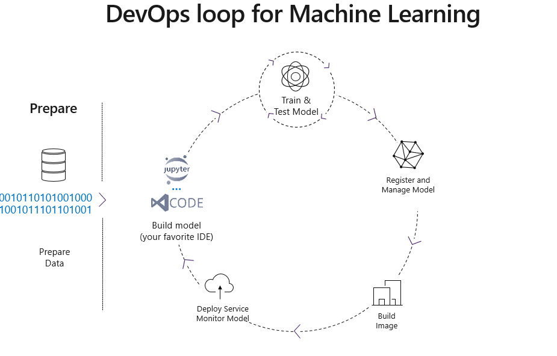
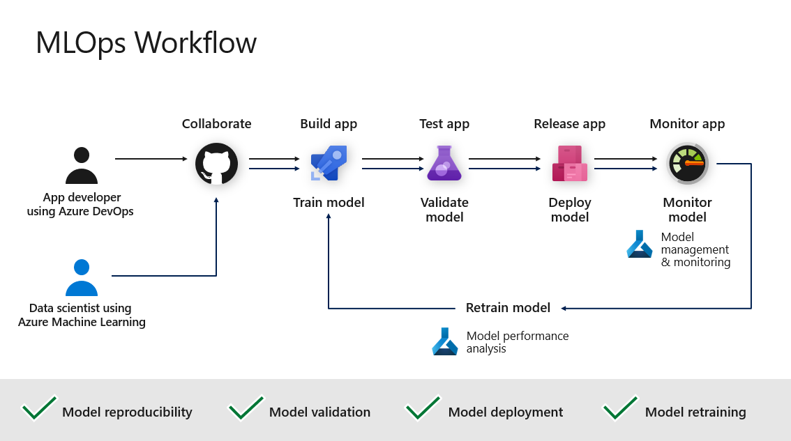

[](LICENSE)

# DevOps for Machine Learning | MLOps

This repository offers practical guidance on implementing MLOps workflows using [Azure Machine Learning](https://docs.microsoft.com/en-us/azure/machine-learning/) and [Azure DevOps](https://docs.microsoft.com/en-us/azure/devops/?view=azure-devops&viewFallbackFrom=vsts).



## Overview

Machine Learning Operations ([MLOps](https://docs.microsoft.com/en-us/azure/machine-learning/concept-model-management-and-deployment)) applies DevOps principles to the machine learning lifecycle, enhancing workflow efficiency and model reliability.

This repository provides code samples and guidelines to configure MLOps workflows on Azure, as illustrated below:



## Features

Azure Machine Learning offers several MLOps capabilities:

- **Machine Learning Pipelines**: Define repeatable and reusable steps for data preparation, training, and scoring processes.

- **Reusable Software Environments**: Create consistent environments for training and deploying models.

- **Model Management**: Register, package, and deploy models with associated metadata from any location.

- **Governance**: Capture comprehensive data throughout the ML lifecycle, including publication history, change reasons, and deployment records.

- **Alerts and Notifications**: Receive updates on key events such as experiment completion, model registration, deployment, and data drift detection.

- **Monitoring**: Oversee ML applications for operational and performance issues, comparing model inputs between training and inference, and exploring model-specific metrics.

- **Automation**: Utilize Azure Machine Learning and Azure Pipelines to automate the end-to-end ML lifecycle, facilitating frequent model updates and continuous deployment.


## Getting Started

To explore and implement these MLOps practices:

1. **Clone the Repository**:

   ```bash
   git clone https://github.com/joydesigner/mlops-practices.git